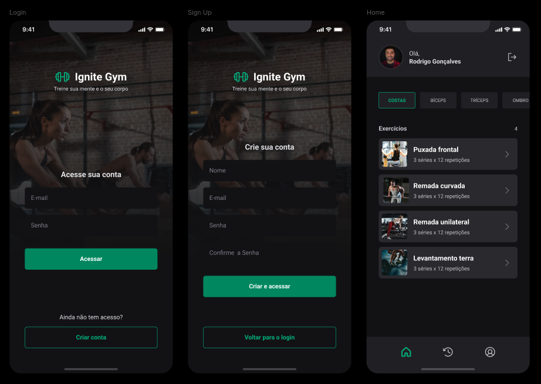
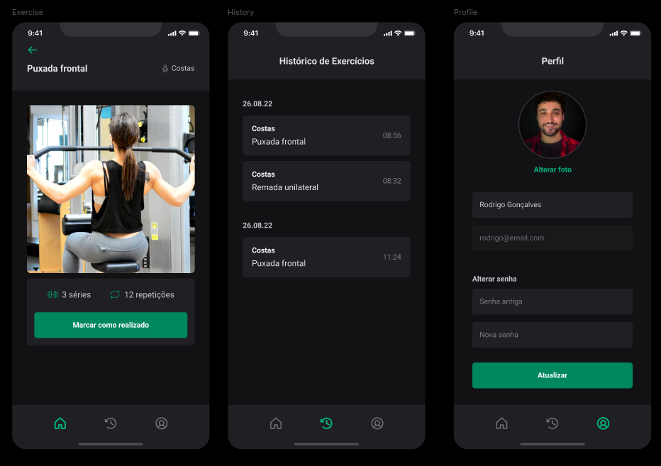

## 📱 Ignite Gym

Projeto desenvolvido no terceiro modulo do curso de React Native da [@Rocketseat](https://www.rocketseat.com.br/) 💜🚀. Onde foi desenvolvido um aplicativo para auxiliar nos treinos de academia,  utlizando uma biblioteca de componentes com foco em aumentar a produtividade e consistência. Também foi feita a integração com back-end implementando as melhores práticas de consumo de API e autenticação com JWT e refresh token.

### ⚙️ Principais Tecnologias

* [React Native](https://reactnative.dev/)
* [Expo](https://expo.dev/)
* [Typescript](https://www.typescriptlang.org/)
* [Native Base](https://nativebase.io/)
* [React Hook Form](https://react-hook-form.com/)
* [Axios](https://axios-http.com/docs/intro)
* [Yup](https://github.com/jquense/yup)

### ✅ Features

-   [X]  Exibir exercício por grupo muscular
-   [X]  Marcar exercício como realizado
-   [X]  Exibir histórico de exercícios realizados
-   [X]  Adicionar e Alterar foto de usuário
-   [X]  Atualizar nome de usuário
-   [X]  Atualizar senha

### 📝 Licença

Esse projeto está sob a licença MIT. Veja o arquivo [LICENSE](LICENSE) para mais detalhes.

---